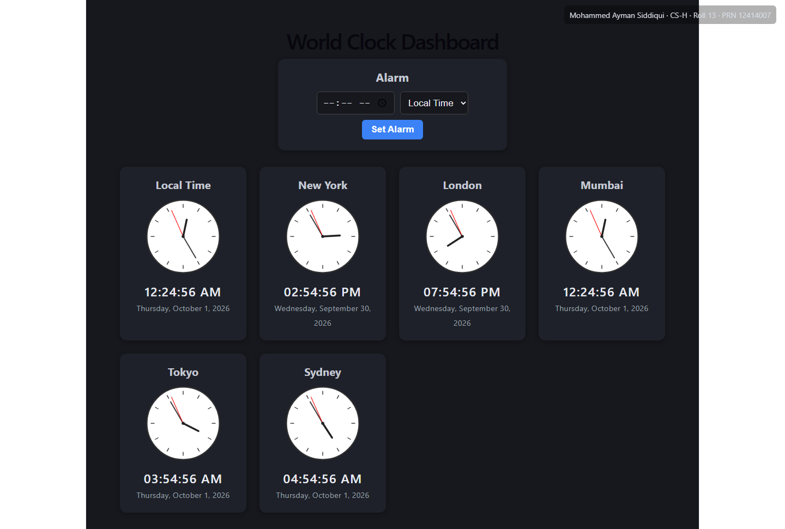
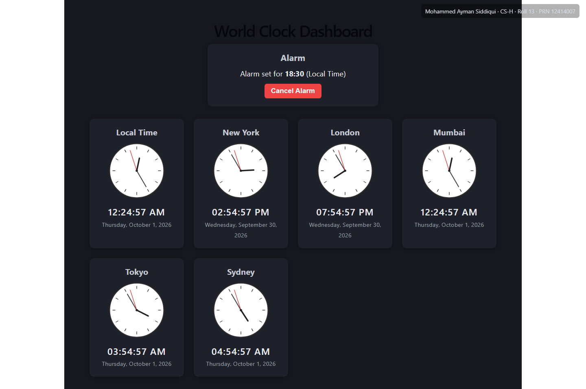

# Real-Time Clock Dashboard

A responsive world clock dashboard built with React, featuring live analog and digital clocks across multiple timezones, plus a configurable alarm system.

## Features

- Live analog clock (SVG-based) with smoothly moving hour, minute, and second hands
- Live digital clock with formatted time and date
- Multiple world regions displayed simultaneously (Local, New York, London, Mumbai, Tokyo, Sydney)
- Alarm feature — set an alarm in any supported timezone, with audible and visual notification
- Fully responsive layout (grid reflows for mobile/tablet/desktop)
- Built using functional components and React Hooks (useState, useEffect, useRef)

## Technologies Used

- React 19 (via Vite)
- JavaScript (ES6+)
- CSS3 (Grid layout, media queries, animations)
- Web Audio API (for alarm sound synthesis)
- Intl API (for timezone-aware date/time formatting)

## Installation & Setup

1. Clone this repository:
```bash
   git clone <repository-url>
   cd real-time-clock-react
```

2. Install dependencies:
```bash
   npm install
```

3. Start the development server:
```bash
   npm run dev
```

4. Open `http://localhost:5173/` in your browser.

## How to Use

- The dashboard displays clocks for six regions by default.
- To set an alarm, choose a time and timezone in the Alarm panel, then click "Set Alarm."
- When the alarm triggers, a beeping tone plays and a visual indicator pulses. Click "Stop Alarm" to silence it.

## Future Improvements

- Allow users to add/remove custom cities from the dashboard
- Support multiple simultaneous alarms
- Add a stopwatch/timer feature
- Persist alarm settings using localStorage

## Screenshots





